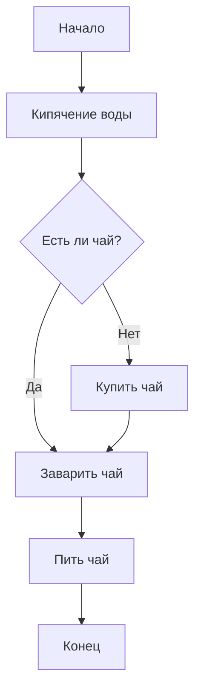
```mermaid
 graph TD;
    A[Начало] --> B[Кипячение воды];
    B --> C{Есть ли чай?};
    C -->|Да| D[Заварить чай];
    C -->|Нет| E[Купить чай];
    E --> D;
    D --> F[Пить чай];
    F --> G[Конец];
```

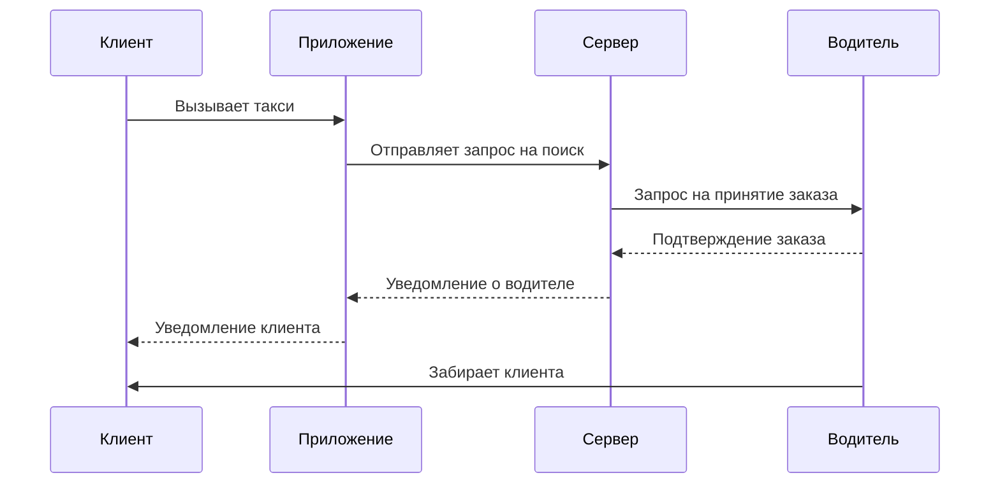
```mermaid
sequenceDiagram
    participant К as Клиент
    participant П as Приложение
    participant С as Сервер
    participant В as Водитель

    К->>П: Вызывает такси
    П->>С: Отправляет запрос на поиск
        С->>В: Запрос на принятие заказа
        В-->>С: Подтверждение заказа
    С-->>П: Уведомление о водителе
    П-->>К: Уведомление клиента
    В->>К: Забирает клиента
```

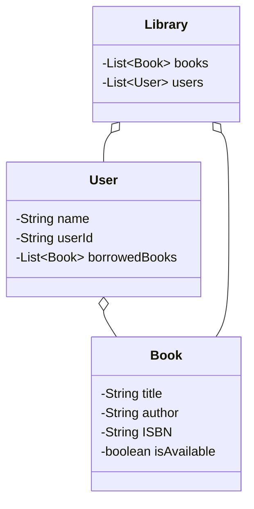
```mermaid
classDiagram
    class Book {
        -String title
        -String author
        -String ISBN
        -boolean isAvailable
    }

    class User {
        -String name
        -String userId
        -List~Book~ borrowedBooks
    }

    class Library {
        -List~Book~ books
        -List~User~ users
    }

    User o-- Book
    Library o-- Book
    Library o-- User
```

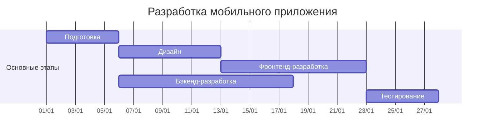
```mermaid
gantt
    title Разработка мобильного приложения
    dateFormat  YYYY-MM-DD
    axisFormat  %d/%m
    section Основные этапы
    Подготовка           :2024-01-01, 5d
    Дизайн               :2024-01-06, 7d
    Фронтенд-разработка  :2024-01-13, 10d
    Бэкенд-разработка    :2024-01-06, 12d
    Тестирование         :2024-01-23, 5d
```

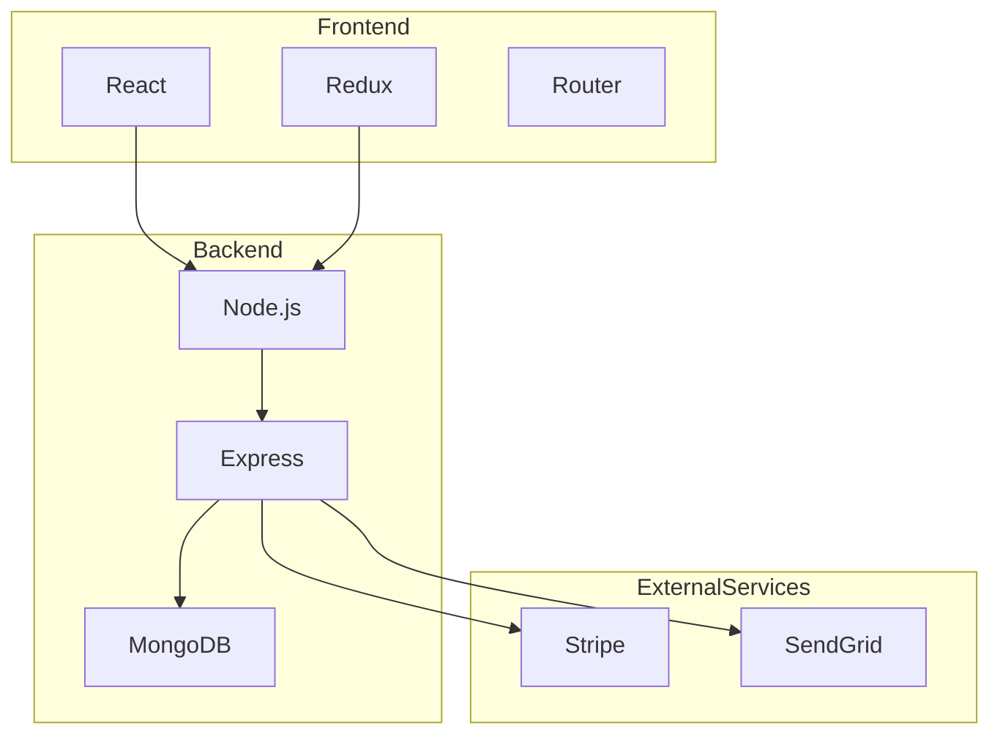
```mermaid
graph TD
    subgraph Frontend
        A[React]
        B[Redux]
        C[Router]
    end

    subgraph Backend
        D[Node.js]
        E[Express]
        F[MongoDB]
    end

    subgraph ExternalServices
        G[Stripe]
        H[SendGrid]
    end

    D --> E
    E --> F

    A --> D
    B --> D

    E --> G
    E --> H
```
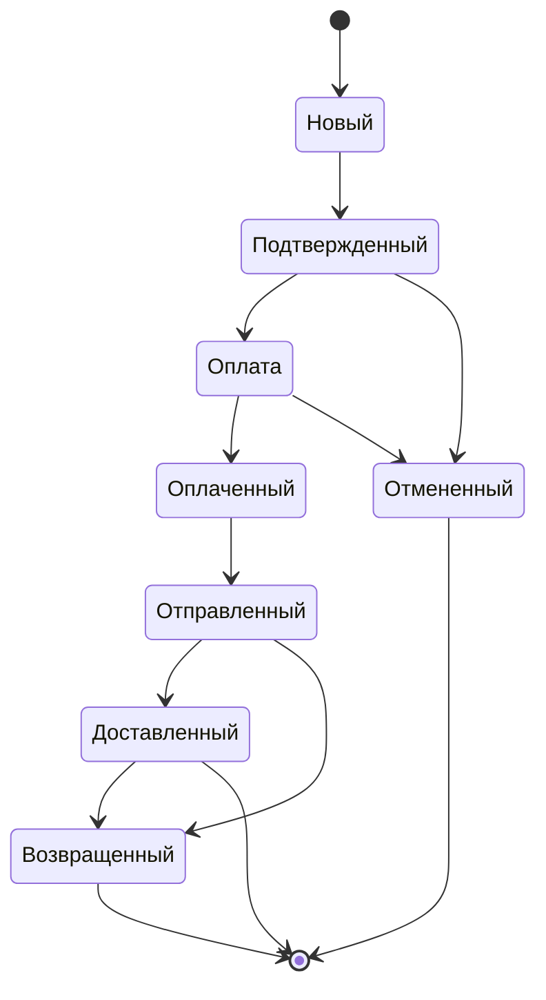
```mermaid
stateDiagram-v2
    [*] --> Новый


    Новый --> Подтвержденный
    Подтвержденный --> Оплата
    Оплата --> Оплаченный
    Оплата --> Отмененный
    Подтвержденный --> Отмененный

    Оплаченный --> Отправленный
    Отправленный --> Доставленный
    Отправленный --> Возвращенный
    Доставленный --> Возвращенный
    Доставленный --> [*]

    Отмененный --> [*]
    Возвращенный --> [*]
```
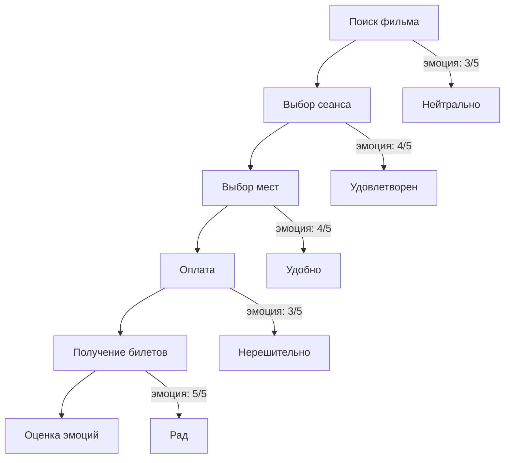
```mermaid
flowchart TD
    A[Поиск фильма] --> B[Выбор сеанса]
    B --> C[Выбор мест]
    C --> D[Оплата]
    D --> E[Получение билетов]
    E --> F[Оценка эмоций]

    A -->|эмоция: 3/5| A1[Нейтрально]
    B -->|эмоция: 4/5| B1[Удовлетворен]
    C -->|эмоция: 4/5| C1[Удобно]
    D -->|эмоция: 3/5| D1[Нерешительно]
    E -->|эмоция: 5/5| E1[Рад]
```

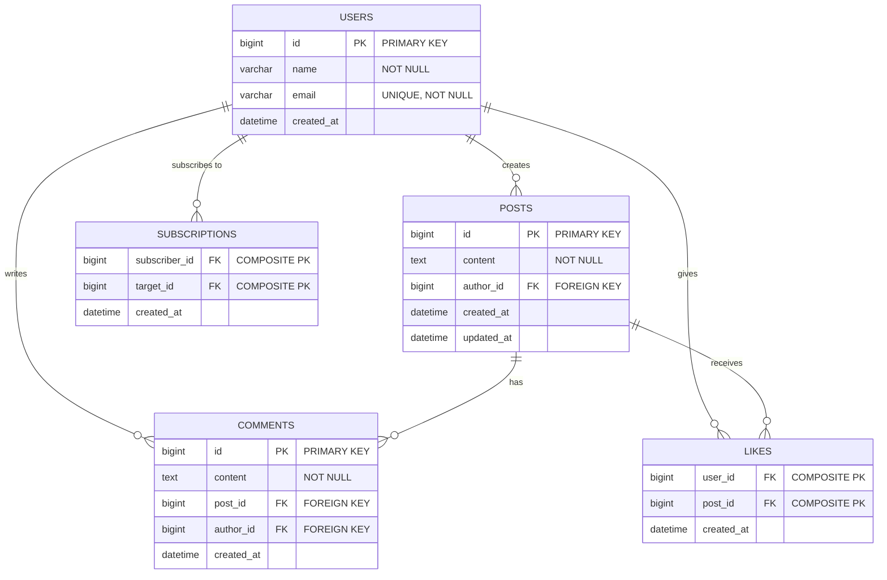
```mermaid
erDiagram
    USERS {
        bigint id PK "PRIMARY KEY"
        varchar name "NOT NULL"
        varchar email "UNIQUE, NOT NULL"
        datetime created_at
    }

    POSTS {
        bigint id PK "PRIMARY KEY"
        text content "NOT NULL"
        bigint author_id FK "FOREIGN KEY"
        datetime created_at
        datetime updated_at
    }

    COMMENTS {
        bigint id PK "PRIMARY KEY"
        text content "NOT NULL"
        bigint post_id FK "FOREIGN KEY"
        bigint author_id FK "FOREIGN KEY"
        datetime created_at
    }

    LIKES {
        bigint user_id FK "COMPOSITE PK"
        bigint post_id FK "COMPOSITE PK"
        datetime created_at
    }

    SUBSCRIPTIONS {
        bigint subscriber_id FK "COMPOSITE PK"
        bigint target_id FK "COMPOSITE PK"
        datetime created_at
    }

    USERS ||--o{ POSTS : creates
    USERS ||--o{ COMMENTS : writes
    USERS ||--o{ LIKES : gives
    POSTS ||--o{ COMMENTS : has
    POSTS ||--o{ LIKES : receives
    USERS ||--o{ SUBSCRIPTIONS : "subscribes to"
```
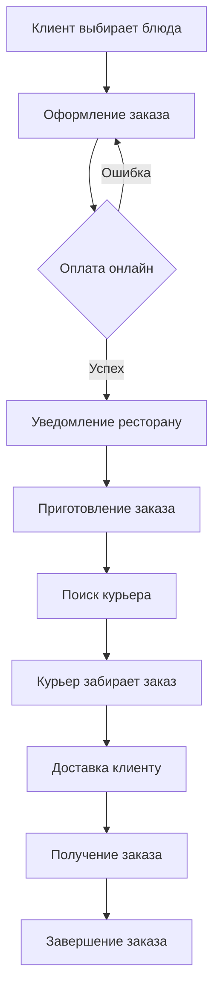
```mermaid
graph TD
    A[Клиент выбирает блюда] --> B[Оформление заказа]
    B --> C{Оплата онлайн}
    C -->|Успех| D[Уведомление ресторану]
    C -->|Ошибка| B
    D --> E[Приготовление заказа]
    E --> F[Поиск курьера]
    F --> G[Курьер забирает заказ]
    G --> H[Доставка клиенту]
    H --> I[Получение заказа]
    I --> J[Завершение заказа]
```
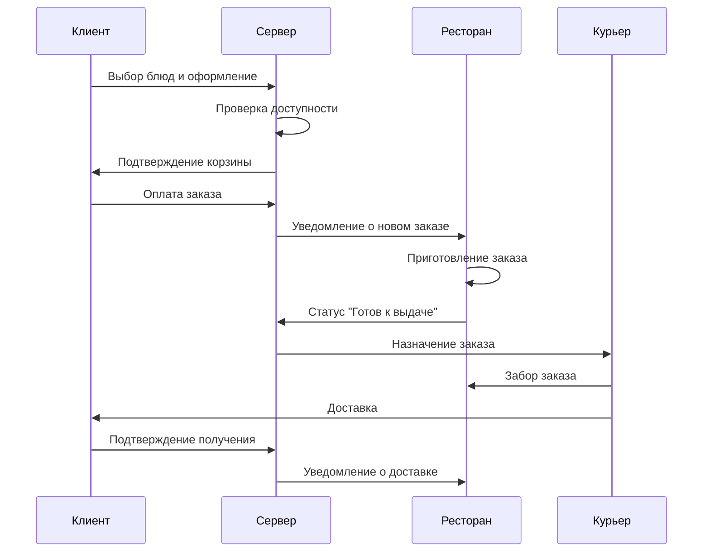
```mermaid
sequenceDiagram
    participant К as Клиент
    participant С as Сервер
    participant Р as Ресторан
    participant Кур as Курьер

    К->>С: Выбор блюд и оформление
    С->>С: Проверка доступности
    С->>К: Подтверждение корзины
    К->>С: Оплата заказа
    С->>Р: Уведомление о новом заказе
    Р->>Р: Приготовление заказа
    Р->>С: Статус "Готов к выдаче"
    С->>Кур: Назначение заказа
    Кур->>Р: Забор заказа
    Кур->>К: Доставка
    К->>С: Подтверждение получения
    С->>Р: Уведомление о доставке
```

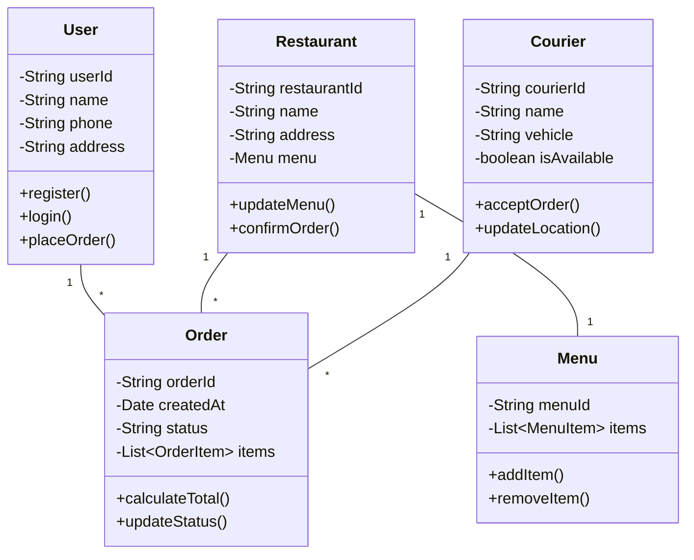
```mermaid
classDiagram
    class User {
        -String userId
        -String name
        -String phone
        -String address
        +register()
        +login()
        +placeOrder()
    }

    class Restaurant {
        -String restaurantId
        -String name
        -String address
        -Menu menu
        +updateMenu()
        +confirmOrder()
    }

    class Order {
        -String orderId
        -Date createdAt
        -String status
        -List~OrderItem~ items
        +calculateTotal()
        +updateStatus()
    }

    class Courier {
        -String courierId
        -String name
        -String vehicle
        -boolean isAvailable
        +acceptOrder()
        +updateLocation()
    }

    class Menu {
        -String menuId
        -List~MenuItem~ items
        +addItem()
        +removeItem()
    }

    User "1" -- "*" Order
    Restaurant "1" -- "*" Order
    Courier "1" -- "*" Order
    Restaurant "1" -- "1" Menu
```

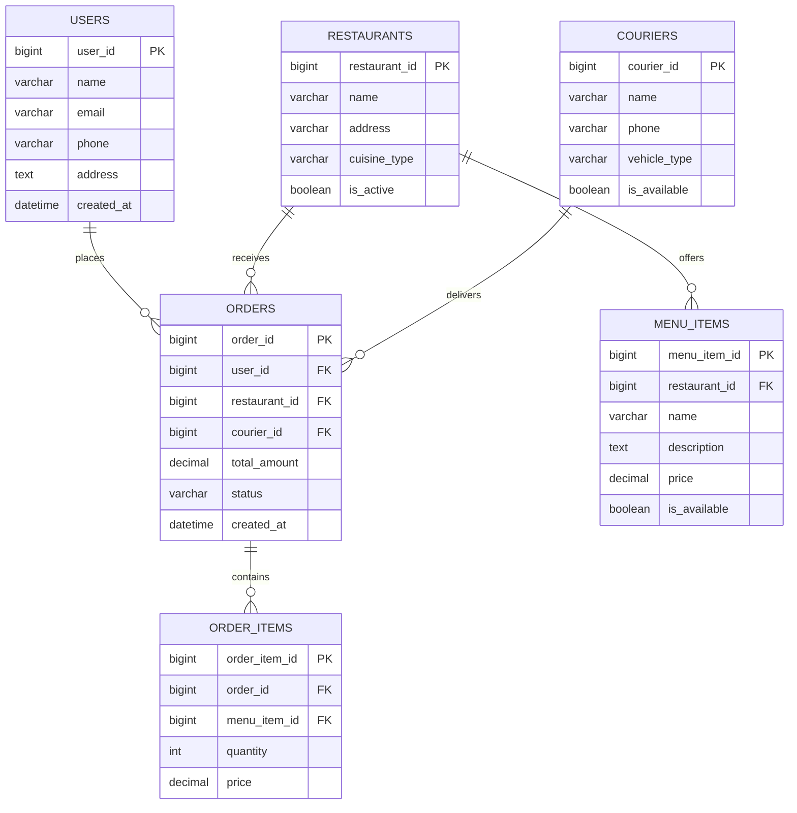
```mermaid
erDiagram
    USERS {
        bigint user_id PK
        varchar name
        varchar email
        varchar phone
        text address
        datetime created_at
    }

    RESTAURANTS {
        bigint restaurant_id PK
        varchar name
        varchar address
        varchar cuisine_type
        boolean is_active
    }

    ORDERS {
        bigint order_id PK
        bigint user_id FK
        bigint restaurant_id FK
        bigint courier_id FK
        decimal total_amount
        varchar status
        datetime created_at
    }

    ORDER_ITEMS {
        bigint order_item_id PK
        bigint order_id FK
        bigint menu_item_id FK
        int quantity
        decimal price
    }

    MENU_ITEMS {
        bigint menu_item_id PK
        bigint restaurant_id FK
        varchar name
        text description
        decimal price
        boolean is_available
    }

    COURIERS {
        bigint courier_id PK
        varchar name
        varchar phone
        varchar vehicle_type
        boolean is_available
    }

    USERS ||--o{ ORDERS : places
    RESTAURANTS ||--o{ ORDERS : receives
    RESTAURANTS ||--o{ MENU_ITEMS : offers
    ORDERS ||--o{ ORDER_ITEMS : contains
    COURIERS ||--o{ ORDERS : delivers
```

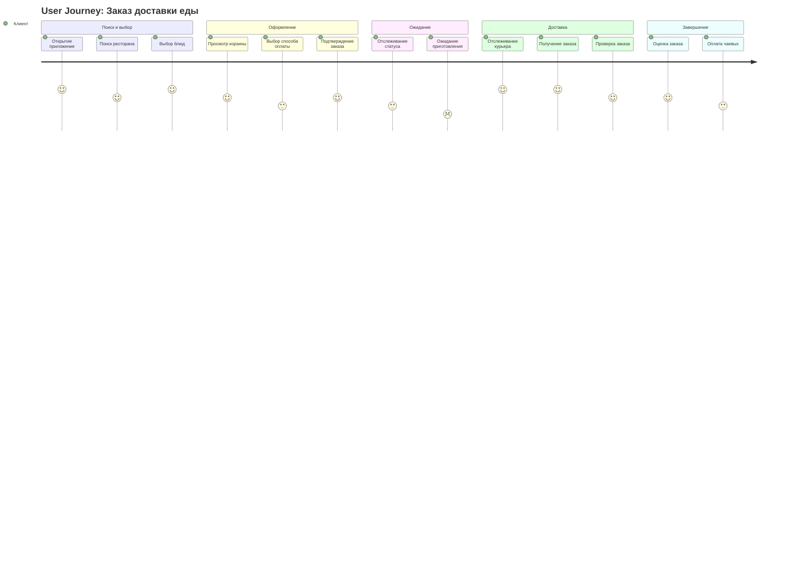
```mermaid
journey
    title User Journey: Заказ доставки еды
    section Поиск и выбор
      Открытие приложения: 5: Клиент
      Поиск ресторана: 4: Клиент
      Выбор блюд: 5: Клиент
    section Оформление
      Просмотр корзины: 4: Клиент
      Выбор способа оплаты: 3: Клиент
      Подтверждение заказа: 4: Клиент
    section Ожидание
      Отслеживание статуса: 3: Клиент
      Ожидание приготовления: 2: Клиент
    section Доставка
      Отслеживание курьера: 5: Клиент
      Получение заказа: 5: Клиент
      Проверка заказа: 4: Клиент
    section Завершение
      Оценка заказа: 4: Клиент
      Оплата чаевых: 3: Клиент
```
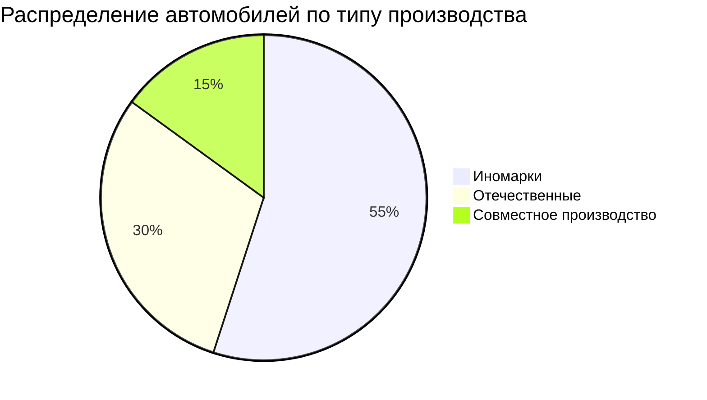
```mermaid
pie title Распределение автомобилей по типу производства
    "Иномарки" : 55
    "Отечественные" : 30
    "Совместное производство" : 15
```
