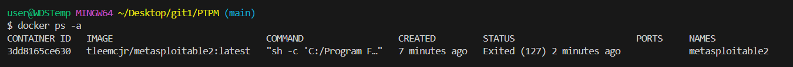
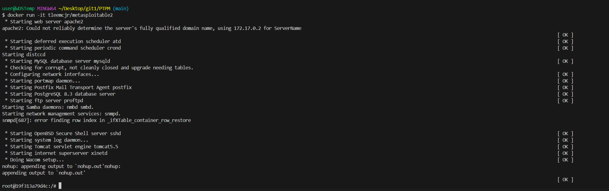

### Инструкция по установке Metasploitable 2 в Docker

#### 1. Подготовка системы
Убедитесь, что установлен Docker:
```bash
docker --version
```

#### 2. Поиск и загрузка образа Metasploitable 2

Сначала найдем доступные образы Metasploitable 2 на Docker Hub:
```bash
docker search metasploitable
```

Наиболее популярный и стабильный образ — `tleemcjr/metasploitable2` . Загрузите его:
```bash
docker pull tleemcjr/metasploitable2:latest
```

*Примечание: Этот образ весит около 600 МБ и основан на уязвимой Ubuntu. Он содержит большинство оригинальных служб Metasploitable 2, за исключением Bind9, NSF и Klogd, которые требуют специфичных модулей ядра .*

#### 3. Создание изолированной сети (рекомендуется)

Для безопасности и удобства создайте отдельную сеть Docker. Это изолирует уязвимую машину от вашей основной системы :
```bash
docker network create pentest
```

#### 4. Запуск контейнера Metasploitable 2

**Вариант А: Интерактивный запуск (рекомендуется):**
```bash
docker run -it \
  --network pentest \
  -h victim \
  --name metasploitable2 \
  tleemcjr/metasploitable2:latest \
  sh -c "/bin/services.sh && bash"
```

**Вариант Б: Фоновый запуск:**
```bash
docker run -d \
  --network pentest \
  -h victim \
  --name metasploitable2 \
  tleemcjr/metasploitable2:latest \
  sh -c "/bin/services.sh && tail -f /dev/null"
```

**Пояснение параметров:**
- `-it` — интерактивный режим с терминалом 
- `--network pentest` — подключение к изолированной сети 
- `-h victim` — понятное имя хоста (вместо идентификатора контейнера) 
- `--name metasploitable2` — имя контейнера 
- `sh -c "/bin/services.sh && bash"` — запуск всех уязвимых служб и открытие shell 

#### 5. Проверка установки

Убедитесь, что контейнер запущен и службы работают:
```bash
# Проверить статус
docker ps -a

# Зайти в контейнер (если запущен в фоне)
docker exec -it metasploitable2 bash

# Внутри контейнера проверить работающие службы
netstat -tulpn | grep LISTEN
```


#### 6. Доступ к системе

**Учетные данные по умолчанию:**
- **Логин:** `msfadmin`
- **Пароль:** `msfadmin` 

Для входа в систему внутри контейнера:
```bash
# Если вы уже внутри контейнера
ssh msfadmin@localhost
# или
su - msfadmin
```

#### 7. Определение IP-адреса

Для взаимодействия с Metasploitable 2 из других контейнеров узнайте его IP-адрес:
```bash
# Узнать IP-адрес контейнера
docker inspect metasploitable2 | grep IPAddress

# Или внутри контейнера выполнить:
ifconfig
# или
ip addr
```

В сети `pentest` контейнер обычно получает IP вида `172.18.0.x` .

#### 8. Проверка доступности служб

Сканирование открытых портов Metasploitable 2 (потребуется второй контейнер с Kali или установка nmap):
```bash
# Из другого контейнера в той же сети
nmap -p- <IP-метасплоита>

# Ожидаемый результат: множество открытых портов 
# PORT     STATE SERVICE
# 21/tcp   open  ftp
# 22/tcp   open  ssh
# 23/tcp   open  telnet
# 25/tcp   open  smtp
# 80/tcp   open  http
# 139/tcp  open  netbios-ssn
# 445/tcp  open  microsoft-ds
# 3306/tcp open  mysql
# 5432/tcp open  postgresql
# 5900/tcp open  vnc
# и другие...
```

#### 9. Основные команды управления

```bash
# Остановка контейнера
docker stop metasploitable2

# Запуск остановленного контейнера
docker start metasploitable2

# Подключение к работающему контейнеру
docker exec -it metasploitable2 bash

# Перезапуск служб внутри контейнера (если что-то не работает)
docker exec metasploitable2 /bin/services.sh

# Просмотр логов
docker logs metasploitable2

# Удаление контейнера
docker rm metasploitable2
```

#### 10. Совместный запуск с Kali Linux

Для полноценного тестирования на проникновение запустите второй контейнер с Kali :

```bash
# Запуск Kali в той же сети
docker run -it \
  --network pentest \
  -h attacker \
  --name kalibox \
  kalilinux/kali-rolling \
  bash

# Внутри Kali установите необходимые инструменты
apt update && apt install -y net-tools nmap metasploit-framework
```

#### 11. Простой пример эксплуатации

После настройки обоих контейнеров можно попробовать эксплуатировать уязвимость vsftpd :

```bash
# В контейнере Kali:
msfconsole

# В Metasploit:
use exploit/unix/ftp/vsftpd_234_backdoor
set RHOST <IP-метасплоита>
set RPORT 21
exploit

# При успехе вы получите shell с root-доступом
whoami  # должно показать root
```

#### Важные замечания

- **НИКОГДА не выставляйте Metasploitable 2 в интернет или рабочую сеть** — эта система содержит критические уязвимости и может быть скомпрометирована за считанные минуты 
- Используйте только в изолированной сети Docker (`pentest`) или в закрытой лабораторной среде 
- Образ `tleemcjr/metasploitable2` не обновлялся около 8 лет, но содержит все основные уязвимости для обучения 
- Некоторые службы (Bind9, NFS) могут не работать из-за ограничений Docker 
- Для сброса состояния просто удалите и создайте контейнер заново
- После завершения работы используйте `docker-compose down` или останавливайте контейнеры, чтобы не тратить ресурсы системы