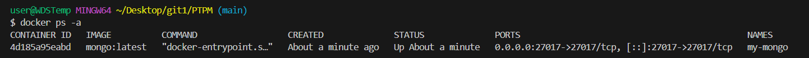
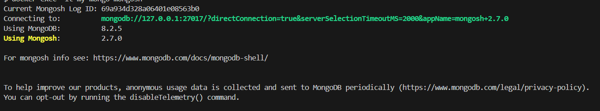

### Инструкция по установке MongoDB в Docker

#### 1. Подготовка системы
Убедитесь, что установлен Docker:
```bash
docker --version
```

#### 2. Запуск контейнера MongoDB

**Базовая установка:**
```bash
# Создать папку для данных
mkdir mongodata

# Запустить контейнер
docker run -d \
  --name my-mongo \
  -p 27017:27017 \
  mongo:latest
```

#### 3. Проверка работы
```bash
# Проверить статус
docker ps -a

# Подключиться к MongoDB
docker exec -it mongodb mongosh

# (Если с паролем)
docker exec -it mongodb mongosh -u admin -p yourpassword --authenticationDatabase admin
```


#### 4. Основные команды в MongoDB Shell
```javascript
show dbs                       // показать базы
use mydb                        // переключиться на БД
db.users.insertOne({name:"Alice", age:28})  // добавить данные
db.users.find()                 // показать все записи
exit                            // выйти
```

#### 5. Управление контейнером
```bash
docker stop mongodb             // остановить
docker start mongodb            // запустить
docker restart mongodb          // перезапустить
docker logs -f mongodb          // просмотр логов
docker rm mongodb               // удалить контейнер
```


#### 6. Простой бэкап и восстановление
```bash
# Бэкап
docker exec mongodb mongodump --out /tmp/backup
docker cp mongodb:/tmp/backup ./backup

# Восстановление
docker cp ./backup mongodb:/tmp/backup
docker exec mongodb mongorestore /tmp/backup
```

#### Важно
- Данные сохраняются в папке `./mongodata`
- Для production используйте пароли и ограничьте доступ к порту 27017
- Для ограничения ресурсов добавьте: `--memory="2g" --cpus="1.5"`