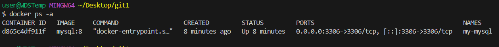
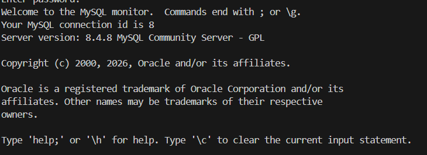
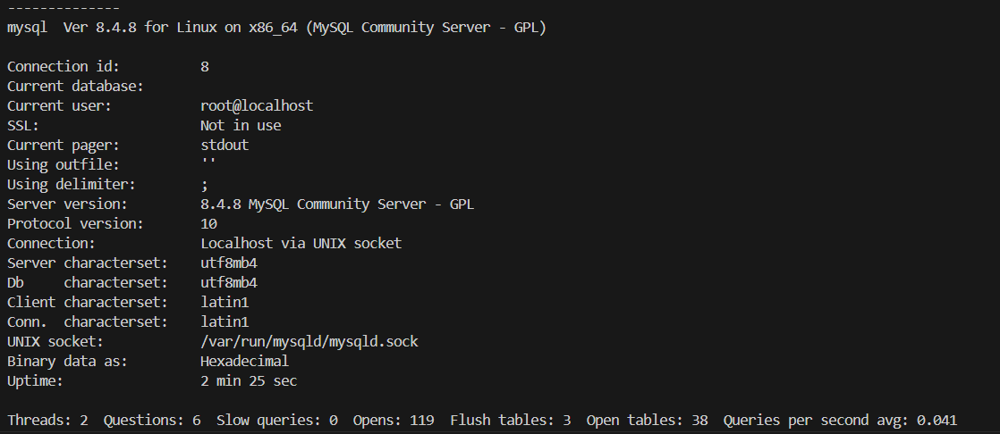

### Инструкция по установке MySQL в Docker

#### 1. Подготовка системы
Убедитесь, что на вашем компьютере установлен Docker. Проверить установку можно командой:
```bash
docker --version
```

#### 2. Создание сети Docker (рекомендуется для изоляции)
Для изоляции контейнера MySQL создайте отдельную сеть (опционально, но удобно для подключения других приложений):
```bash
docker network create mysql-network
```

#### 3. Запуск контейнера с MySQL
Запустите контейнер MySQL с необходимыми настройками. Существует несколько версий MySQL; в примере используется последняя стабильная версия 8.

**Базовый запуск:**
```bash
docker run -d \
  --name my-mysql \
  -p 3306:3306 \
  -e MYSQL_ROOT_PASSWORD=rootpassword \
  -e MYSQL_DATABASE=mydb \
  -e MYSQL_USER=user \
  -e MYSQL_PASSWORD=password \
  mysql:8
```


#### 4. Проверка установки
Убедитесь, что контейнер успешно запущен:
```bash
docker ps -a
```

Вы должны увидеть контейнер `mysql-server` со статусом `Up` и портом `0.0.0.0:3306->3306/tcp`.


#### 5. Подключение к MySQL
Существует несколько способов подключиться к запущенному MySQL.

**Способ А: Подключение из контейнера (внутри Docker):**
```bash
docker exec -it mysql-server mysql -u root -p
```
После ввода пароля (`my-secret-pw`) вы попадете в консоль MySQL.



**Способ Б: Подключение с хост-машины:**
Если на вашем компьютере установлен MySQL-клиент:
```bash
mysql -h 127.0.0.1 -P 3306 -u root -p
```

**Способ В: Подключение через другой контейнер в той же сети:**
Запустите временный клиентский контейнер:
```bash
docker run -it --network mysql-network --rm mysql mysql -h mysql-server -u root -p
```

#### 6. Основные команды для работы с MySQL внутри контейнера
После подключения к MySQL можно выполнять стандартные SQL-запросы:
```sql
-- Показать все базы данных
SHOW DATABASES;

-- Переключиться на базу данных
USE mydb;

-- Показать все таблицы
SHOW TABLES;

-- Создать тестовую таблицу
CREATE TABLE test (id INT PRIMARY KEY, name VARCHAR(50));

-- Выйти из MySQL
EXIT;
```


#### 7. Управление контейнером MySQL
- Остановка контейнера:
  ```bash
  docker stop mysql-server
  ```
- Запуск остановленного контейнера:
  ```bash
  docker start mysql-server
  ```
- Перезапуск контейнера:
  ```bash
  docker restart mysql-server
  ```
- Удаление контейнера (данные сохраняются в томе `mysql-data`):
  ```bash
  docker rm mysql-server
  ```
- Просмотр логов в реальном времени:
  ```bash
  docker logs -f mysql-server
  ```

#### 8. Работа с данными (бэкап и восстановление)

**Создание бэкапа базы данных:**
```bash
docker exec mysql-server mysqldump -u root -p"my-secret-pw" --all-databases > backup.sql
```

**Восстановление из бэкапа:**
```bash
cat backup.sql | docker exec -i mysql-server mysql -u root -p"my-secret-pw"
```

#### Важные замечания

1. **Пароль root**: Параметр `MYSQL_ROOT_PASSWORD` является обязательным. Без него контейнер не запустится.
2. **Сохранение данных**: Использование тома (`-v mysql-data:/var/lib/mysql`) критически важно для production-среды, иначе при удалении контейнера вы потеряете все данные.
3. **Версии MySQL**: Можно использовать разные версии, указав соответствующий тег: `mysql:5.7`, `mysql:8.0`, `mysql:8` (последняя стабильная 8.x).
4. **Ресурсы**: По умолчанию контейнер не ограничен в ресурсах. Для production рекомендуется задавать лимиты памяти и CPU:
   ```bash
   --memory="1g" --cpus="1.0"
   ```
5. **Логирование**: Для production также рекомендуется настроить ротацию логов Docker или перенаправить логи в отдельную систему.
6. **Безопасность**: В production никогда не используйте простые пароли и не пробрасывайте порт наружу без необходимости. Рассмотрите использование Docker Secrets для управления паролями.