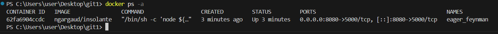
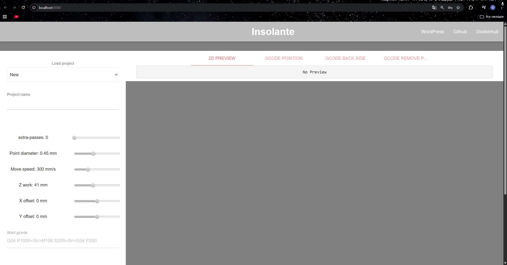

### Инструкция по установке pcb2gcode в Docker

#### 1. Подготовка системы
Убедитесь, что установлен Docker:
```bash
docker --version
```

#### 2. Запуск контейнера с pcb2gcode

**Вариант А: Использование готового образа**
```bash
# Запуск контейнера с pcb2gcode
docker run --rm -p 8080:5000 -d `
  -e URL=http://localhost `
  -e RPORT=8080 `
  -e DEBUG=false `
  -v C:\insolante_data:/opt/core/data `
  ngargaud/insolante
```

#### 3. Проверка установки
```bash
docker ps -a
```


#### 4. Доступ к веб-интерфейсу
Откройте браузер и перейдите по адресу:
```
http://localhost:8081
```


#### 5. Основные команды
```bash
# Вход в контейнер для интерактивной работы
docker run -it --rm \
  -v $(pwd):/workdir \
  --workdir /workdir \
  ghcr.io/pcb2gcode/pcb2gcode:latest \
  bash

# Запуск с конкретными параметрами
docker run --rm \
  -v $(pwd):/workdir \
  --workdir /workdir \
  ghcr.io/pcb2gcode/pcb2gcode:latest \
  pcb2gcode \
  --drill test.drl \
  --front test_front.gbr \
  --back test_back.gbr \
  --outline test_outline.gbr
```

#### 6. Управление
```bash
# Остановка контейнера (если запущен в фоне)
docker stop pcb2gcode

# Удаление контейнера
docker rm pcb2gcode

# Удаление образа
docker rmi ghcr.io/pcb2gcode/pcb2gcode:latest
```

#### Важно
- Используйте `--rm` для автоматического удаления контейнера после выполнения
- Все входные файлы должны находиться в текущей директории (или монтировать нужную папку через `-v`)
- Результаты работы сохранятся в той же директории благодаря монтированию тома
- Образ включает все зависимости pcb2gcode (Boost, Cairo, GerbV и др.)