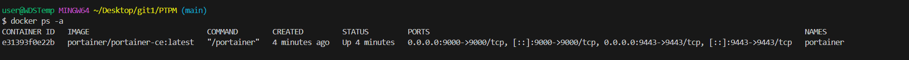
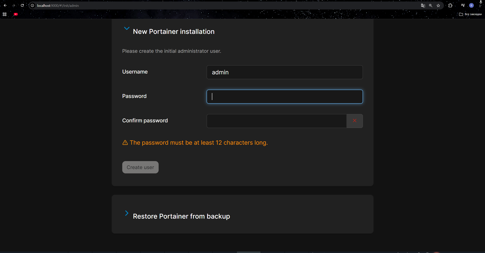
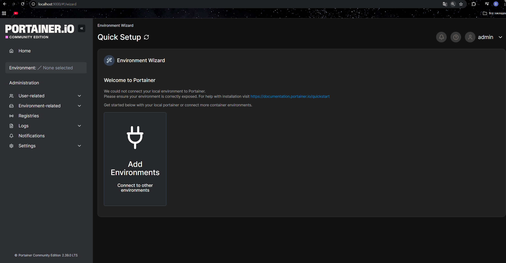

Вот инструкция по установке Portainer в Docker, оформленная в том же стиле, что и предыдущие версии.

### Инструкция по установке Portainer в Docker

#### 1. Подготовка системы
Убедитесь, что на вашем компьютере установлен Docker. Проверить установку можно командой:
```bash
docker --version
```

#### 2. Создание тома для данных Portainer
Portainer хранит свою конфигурацию, данные пользователей и информацию об окружениях в томе Docker. Создайте отдельный том для сохранения этих данных:
```bash
docker volume create portainer_data
```

#### 3. Запуск контейнера Portainer
Запустите контейнер Portainer Community Edition (CE) с необходимыми настройками :

```bash
docker run -d \
  --name portainer \
  -p 9000:9000 \
  -p 9443:9443 \
  -v /var/run/docker.sock:/var/run/docker.sock \
  -v portainer_data:/data \
  --restart unless-stopped \
  portainer/portainer-ce:latest
```

**Пояснение параметров:**
- `-d` — запуск в фоновом режиме
- `--name portainer` — имя контейнера
- `--restart=always` — автоматический перезапуск контейнера при сбоях или перезагрузке Docker 
- `-p 8000:8000` — проброс порта для HTTP-туннеля (требуется для функций Edge-вычислений) 
- `-p 9443:443` — проброс порта для веб-интерфейса с шифрованием (HTTPS) 
- `-v /var/run/docker.sock:/var/run/docker.sock` — монтирование сокета Docker, что позволяет Portainer управлять Docker-демоном хоста 
- `-v portainer_data:/data` — монтирование тома для хранения данных Portainer 
- `portainer/portainer-ce:lts` — официальный образ Portainer Community Edition с долгосрочной поддержкой 

*Примечание: Если вам нужна последняя версия с актуальными функциями, можно использовать тег `:latest` вместо `:lts` .*

#### 4. Проверка установки
Убедитесь, что контейнер успешно запущен:
```bash
docker ps -a
```

Вы должны увидеть контейнер `portainer` со статусом `Up` и проброшенными портами.

Проверьте логи для подтверждения успешного запуска:
```bash
docker logs portainer
```

#### 5. Доступ к веб-интерфейсу
Откройте браузер и перейдите по адресу:
```
https://localhost:9000
```




*Примечание: Portainer использует самоподписанный SSL-сертификат, поэтому браузер может показать предупреждение о небезопасном соединении. Это нормально для локальной установки .*

#### 6. Первоначальная настройка
При первом входе в систему вас встретит мастер настройки :

1. **Создание пользователя-администратора**: Задайте имя пользователя и пароль. Пароль должен быть сложным и содержать не менее 12 символов .
2. **Подключение окружения**: После создания пользователя Portainer предложит подключить Docker-окружение. Выберите "Get Started" для управления локальным Docker-хостом .
3. **Завершение настройки**: После этого вы попадете на главную панель управления Portainer.

*Важно: Создание администратора веб-интерфейса Portainer ограничено по времени. Если вы не создали пользователя в течение отведенного времени, перезапустите контейнер Portainer :*
```bash
docker restart portainer
```

#### 7. Основные возможности Portainer
После входа в систему вы получаете доступ к графическому интерфейсу для управления всеми аспектами Docker :

- **Контейнеры** — просмотр списка, запуск, остановка, перезапуск, удаление, просмотр логов и статистики
- **Образы** — просмотр, загрузка (pull), удаление, создание новых образов
- **Сети** — управление Docker-сетями
- **Тома** — управление томами для хранения данных
- **Стеки** — развертывание и управление приложениями через Docker Compose
- **Хост** — просмотр информации о системе (CPU, память, диски)

#### 8. Управление контейнером Portainer
- Остановка контейнера:
  ```bash
  docker stop portainer
  ```
- Запуск остановленного контейнера:
  ```bash
  docker start portainer
  ```
- Перезапуск контейнера:
  ```bash
  docker restart portainer
  ```
- Просмотр логов в реальном времени:
  ```bash
  docker logs -f portainer
  ```

#### 9. Обновление Portainer
Для обновления до новой версии выполните следующие шаги :

```bash
# Остановить и удалить существующий контейнер
docker stop portainer
docker rm portainer

# Скачать новую версию образа
docker pull portainer/portainer-ce:lts

# Запустить контейнер заново с теми же параметрами
docker run -d -p 8000:8000 -p 9443:9443 --name portainer --restart=always -v /var/run/docker.sock:/var/run/docker.sock -v portainer_data:/data portainer/portainer-ce:lts
```

#### 10. Удаление Portainer
Если необходимо полностью удалить Portainer :

```bash
# Остановить и удалить контейнер
docker stop portainer
docker rm portainer

# Удалить том с данными (все настройки будут потеряны!)
docker volume rm portainer_data
```

#### Важные замечания

1. **Безопасность**: Portainer предоставляет полный контроль над Docker, поэтому надежно защитите учетную запись администратора .
2. **Самоподписанный сертификат**: При использовании в production рекомендуется настроить собственный SSL-сертификат или использовать обратный прокси-сервер (например, Traefik или Nginx) .
3. **Ресурсы**: Portainer достаточно легковесен и подходит как для production-сред, так и для домашних лабораторий .
4. **Мониторинг**: Portainer позволяет отслеживать использование ресурсов контейнеров прямо из веб-интерфейса .
5. **Управление несколькими серверами**: Portainer может управлять несколькими Docker-хостами через Portainer Agent, который устанавливается на удаленные серверы .