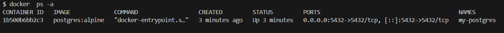
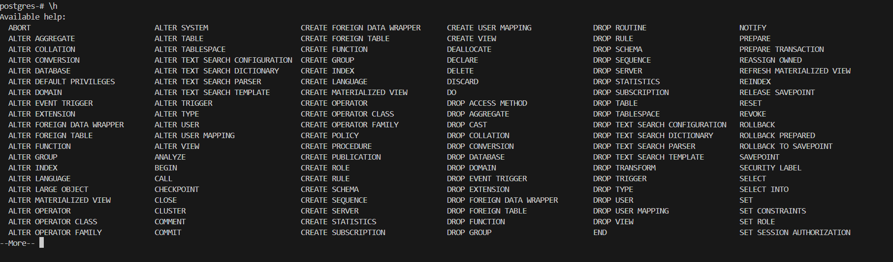

### Инструкция по установке PostgreSQL в Docker

#### 1. Подготовка системы
Убедитесь, что установлен Docker:
```bash
docker --version
```

#### 2. Запуск контейнера PostgreSQL

**Базовая установка:**
```bash
# Создать папку для данных
mkdir postgres_data

# Запустить контейнер
docker run -d \
  --name postgres-server \
  -p 5432:5432 \
  -e POSTGRES_PASSWORD=mysecretpassword \
  -v ./postgres_data:/var/lib/postgresql/data \
  postgres:latest
```

**С дополнительными настройками:**
```bash
docker run -d \
  --name postgres-server \
  -p 5432:5432 \
  -e POSTGRES_USER=myuser \
  -e POSTGRES_PASSWORD=mypassword \
  -e POSTGRES_DB=mydatabase \
  -v ./postgres_data:/var/lib/postgresql/data \
  postgres:15
```

**Пояснение параметров:**
- `-d` — запуск в фоновом режиме
- `--name` — имя контейнера
- `-p 5432:5432` — проброс стандартного порта PostgreSQL
- `-e POSTGRES_PASSWORD` — **обязательный параметр**, пароль для пользователя postgres
- `-e POSTGRES_USER` — имя пользователя (по умолчанию postgres)
- `-e POSTGRES_DB` — имя базы данных, которая будет создана при первом запуске
- `-v ./postgres_data:/var/lib/postgresql/data` — монтирование папки для сохранения данных

#### 3. Проверка установки
```bash
# Проверить статус
docker ps -a 

# Посмотреть логи
docker logs postgres-server

# Подключиться к PostgreSQL
docker exec -it postgres-server psql -U postgres

# (Если указали другого пользователя)
docker exec -it postgres-server psql -U myuser -d mydatabase
```


#### 4. Основные команды в PostgreSQL
После подключения через `psql`:

```sql
-- Показать все базы данных
\l

-- Подключиться к базе данных
\c mydatabase

-- Показать все таблицы
\dt

-- Создать таблицу
CREATE TABLE users (
    id SERIAL PRIMARY KEY,
    name VARCHAR(100),
    age INTEGER
);

-- Добавить данные
INSERT INTO users (name, age) VALUES ('Alice', 28);

-- Посмотреть данные
SELECT * FROM users;

-- Выйти из psql
\q
```


#### 5. Управление контейнером
```bash
# Остановка
docker stop postgres-server

# Запуск остановленного
docker start postgres-server

# Перезапуск
docker restart postgres-server

# Просмотр логов
docker logs -f postgres-server

# Удаление контейнера (данные сохраняются в папке)
docker rm postgres-server
```

#### 6. Бэкап и восстановление

**Создание бэкапа:**
```bash
# Бэкап всех баз данных
docker exec -t postgres-server pg_dumpall -U postgres > backup.sql

# Бэкап конкретной базы
docker exec -t postgres-server pg_dump -U postgres mydatabase > mydatabase_backup.sql
```

**Восстановление из бэкапа:**
```bash
# Восстановление всех баз
cat backup.sql | docker exec -i postgres-server psql -U postgres

# Восстановление конкретной базы
cat mydatabase_backup.sql | docker exec -i postgres-server psql -U postgres -d mydatabase
```

#### 7. Docker Compose (удобный вариант)
Создайте файл `docker-compose.yml`:

```yaml
version: '3.8'
services:
  postgres:
    image: postgres:15
    container_name: postgres-server
    ports:
      - "5432:5432"
    environment:
      POSTGRES_USER: myuser
      POSTGRES_PASSWORD: mypassword
      POSTGRES_DB: mydatabase
    volumes:
      - ./postgres_data:/var/lib/postgresql/data
    restart: always
```

Запуск:
```bash
docker-compose up -d
```

#### 8. Подключение из другой программы
```bash
# Параметры подключения:
# Хост: localhost
# Порт: 5432
# База данных: mydatabase (или postgres)
# Пользователь: myuser (или postgres)
# Пароль: mypassword (или mysecretpassword)

# Пример подключения через psql (если установлен локально)
psql -h localhost -p 5432 -U myuser -d mydatabase
```

#### Важно
- Параметр `POSTGRES_PASSWORD` обязателен, без него контейнер не запустится 
- Данные сохраняются в локальной папке `./postgres_data`
- Для production используйте надежные пароли и ограничьте доступ к порту 5432
- Для ограничения ресурсов добавьте: `--memory="1g" --cpus="1.0"`
- Разные версии PostgreSQL: `postgres:13`, `postgres:14`, `postgres:15`, `postgres:16`, `postgres:17`