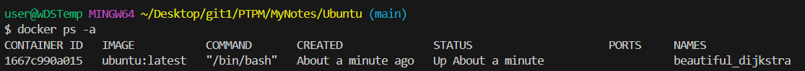
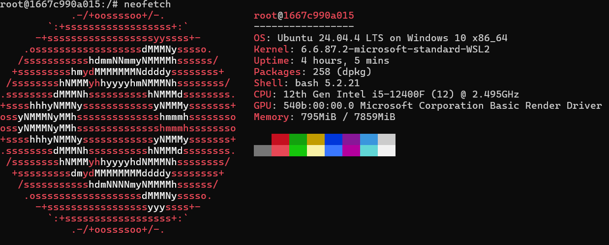

### Инструкция по установке Ubuntu в Docker

#### 1. Подготовка системы
Убедитесь, что установлен Docker:
```bash
docker --version
```

#### 2. Скачивание образа Ubuntu
```bash
# Скачать последнюю версию Ubuntu
docker pull ubuntu:latest

# Или конкретную версию
docker pull ubuntu:22.04  # Ubuntu 22.04 LTS
docker pull ubuntu:20.04  # Ubuntu 20.04 LTS
docker pull ubuntu:24.04  # Ubuntu 24.04 LTS
```

#### 3. Запуск контейнера Ubuntu

**Интерактивный режим (с доступом в терминал):**
```bash
# Запустить и сразу войти в контейнер
docker run -it --name ubuntu-container ubuntu:latest bash

# Или запустить с монтированием папки
docker run -it \
  --name ubuntu-container \
  -v $(pwd):/workspace \
  ubuntu:latest bash
```

**Фоновый режим:**
```bash
docker run -d \
  --name ubuntu-container \
  -v $(pwd):/workspace \
  ubuntu:latest \
  sleep infinity
```

**Пояснение параметров:**
- `-it` — интерактивный режим с терминалом
- `--name` — имя контейнера
- `-v $(pwd):/workspace` — монтирование текущей папки в контейнер
- `-d` — запуск в фоновом режиме
- `sleep infinity` — команда, которая держит контейнер работающим

#### 4. Проверка установки
```bash
# Проверить запущенные контейнеры
docker ps -a


# Узнать версию Ubuntu внутри контейнера
docker exec ubuntu-container cat /etc/os-release

# Или зайти в контейнер и проверить
docker exec -it ubuntu-container bash
# Внутри контейнера:
lsb_release -a
# или
cat /etc/os-release
```

#### 5. Базовые команды внутри Ubuntu
После входа в контейнер (`docker exec -it ubuntu-container bash`):

```bash
# Обновить список пакетов
apt-get update

# Установить программы
apt-get install -y vim nano curl wget git htop

# Создать файл
echo "Hello from Ubuntu container" > test.txt

# Посмотреть содержимое
cat test.txt

# Создать папку
mkdir myproject

# Перейти в смонтированную папку
cd /workspace

# Выйти из контейнера
exit
```


#### 6. Управление контейнером
```bash
# Подключиться к работающему контейнеру
docker exec -it ubuntu-container bash

# Остановить контейнер
docker stop ubuntu-container

# Запустить остановленный контейнер
docker start ubuntu-container

# Перезапустить контейнер
docker restart ubuntu-container

# Посмотреть логи
docker logs ubuntu-container

# Удалить контейнер
docker rm ubuntu-container
```

#### 7. Копирование файлов
```bash
# Скопировать файл с хоста в контейнер
docker cp myfile.txt ubuntu-container:/home/

# Скопировать файл из контейнера на хост
docker cp ubuntu-container:/home/myfile.txt ./
```

#### 8. Создание своего образа с настройками
Создайте файл `Dockerfile`:

```dockerfile
FROM ubuntu:22.04

# Обновление и установка пакетов
RUN apt-get update && apt-get install -y \
    vim \
    curl \
    wget \
    git \
    python3 \
    python3-pip \
    && rm -rf /var/lib/apt/lists/*

# Создание рабочей директории
WORKDIR /app

# Копирование файлов
COPY . /app

# Команда по умолчанию
CMD ["/bin/bash"]
```

Сборка и запуск:
```bash
# Собрать образ
docker build -t my-ubuntu .

# Запустить контейнер из своего образа
docker run -it --name my-ubuntu-container my-ubuntu
```

#### 9. Docker Compose вариант
Создайте файл `docker-compose.yml`:

```yaml
version: '3.8'
services:
  ubuntu:
    image: ubuntu:22.04
    container_name: ubuntu-dev
    stdin_open: true   # аналог -i
    tty: true          # аналог -t
    volumes:
      - ./workspace:/workspace
    working_dir: /workspace
    command: /bin/bash
```

Запуск:
```bash
docker-compose up -d
docker-compose exec ubuntu bash
```

#### 10. Полезные примеры

**Запуск и выполнение одной команды:**
```bash
# Выполнить команду и удалить контейнер
docker run --rm ubuntu:latest echo "Hello World"

# Узнать версию Ubuntu
docker run --rm ubuntu:latest lsb_release -a

# Обновить пакеты
docker run --rm ubuntu:latest apt-get update
```

**Интерактивная разработка:**
```bash
# Запустить с доступом к текущей папке
docker run -it --rm \
  -v $(pwd):/app \
  -w /app \
  ubuntu:22.04 \
  bash

# Теперь можно работать с файлами проекта внутри Ubuntu
```

**Запуск с ограничением ресурсов:**
```bash
docker run -it \
  --name ubuntu-container \
  --memory="512m" \
  --cpus="0.5" \
  ubuntu:latest \
  bash
```

#### Важно
- Образ Ubuntu весит около 70-80 МБ (минимальная установка)
- По умолчанию в контейнере нет графического интерфейса, только командная строка
- При удалении контейнера все изменения внутри него пропадают (кроме данных в смонтированных папках)
- Для сохранения изменений создавайте свой образ через `docker commit` или `Dockerfile`
- Используйте `--rm` для автоматического удаления контейнера после завершения работы