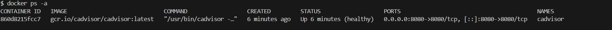
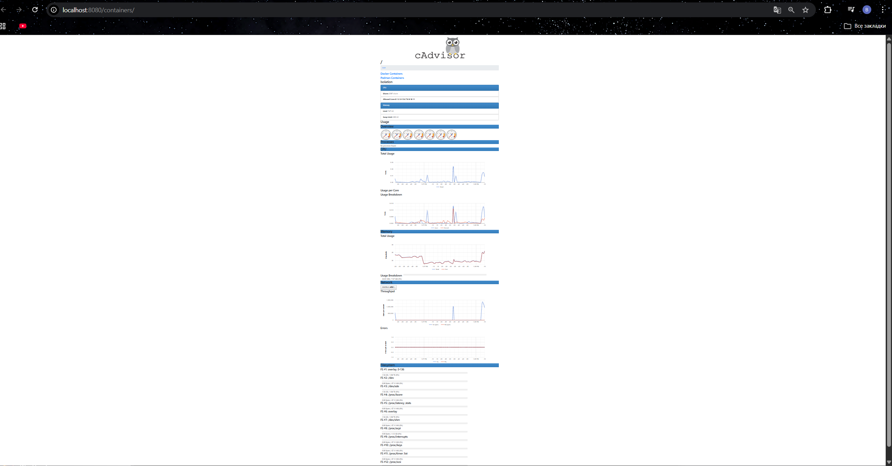

Вот полная инструкция по управлению cAdvisor в Docker через консоль Bash.

## Установка и запуск cAdvisor

### Шаг 1: Скачать и запустить контейнер

Выполните эту команду для установки и запуска cAdvisor:

```bash
  docker run \
  --volume=/:/rootfs:ro \
  --volume=/var/run:/var/run:rw \
  --volume=/sys:/sys:ro \
  --volume=/var/lib/docker/:/var/lib/docker:ro \
  --publish=8080:8080 \
  --detach=true \
  --restart=always \
  --name=cadvisor \
  gcr.io/cadvisor/cadvisor:latest
```

**Краткое описание флагов:**
- `-d` — запуск в фоновом режиме (detach)
- `--name=cadvisor` — имя контейнера
- `--restart=always` — автоматический перезапуск
- `-p 8080:8080` — проброс порта для веб-интерфейса
- `-v` — монтирование системных директорий для сбора метрик

### Шаг 2: Проверить, что контейнер запустился

```bash
sudo docker ps
```

Или посмотреть логи:
```bash
sudo docker logs cadvisor
```

### Шаг 3: Открыть веб-интерфейс

После успешного запуска откройте браузер и перейдите по адресу:
- **Локально:** http://localhost:8080
- **На сервере:** http://<IP-адрес-сервера>:8080

Вы увидите дашборд cAdvisor с метриками всех запущенных контейнеров.

---

## Основные команды для управления

### Просмотр статуса
```bash
sudo docker ps -a | grep cadvisor
```

### Остановка контейнера
```bash
sudo docker stop cadvisor
```

### Запуск уже созданного контейнера
```bash
sudo docker start cadvisor
```

### Перезапуск контейнера
```bash
sudo docker restart cadvisor
```

### Просмотр логов в реальном времени
```bash
sudo docker logs -f cadvisor
```

---

## Полное удаление cAdvisor

Если вам нужно полностью удалить cAdvisor с системы:

### Шаг 1: Остановить контейнер (если запущен)
```bash
sudo docker stop cadvisor
```

### Шаг 2: Удалить контейнер
```bash
sudo docker rm cadvisor
```

### Шаг 3 (опционально): Удалить образ
Если вы хотите освободить место на диске:
```bash
sudo docker rmi gcr.io/cadvisor/cadvisor:latest
```

### Шаг 4: Проверить, что всё удалено
```bash
sudo docker ps -a | grep cadvisor  # не должно выводить ничего
sudo docker images | grep cadvisor  # не должно выводить ничего (если удалили образ)
```

---

## Docker Compose (альтернативный способ)

Если вы используете Docker Compose, создайте файл `docker-compose.yml`:

```yaml
version: '3.8'

services:
  cadvisor:
    image: gcr.io/cadvisor/cadvisor:latest
    container_name: cadvisor
    restart: always
    ports:
      - "8080:8080"
    volumes:
      - /:/rootfs:ro
      - /var/run:/var/run:rw
      - /sys:/sys:ro
      - /var/lib/docker/:/var/lib/docker:ro
```

Запуск:
```bash
sudo docker-compose up -d
```

Удаление:
```bash
sudo docker-compose down
sudo docker rmi gcr.io/cadvisor/cadvisor:latest
```

---

## Возможные проблемы и решения

| Проблема | Решение |
|----------|---------|
| **Ошибка доступа к /var/lib/docker** | Добавьте эту папку в File Sharing (Docker Desktop → Settings → Resources → File Sharing) |
| **Ошибка с SELinux (CentOS/RHEL/Fedora)** | Добавьте флаг `:z` к каждому volume: `-v /:/rootfs:ro,z` или временно отключите SELinux |
| **Ошибка /dev/kmsg** | Добавьте флаг: `--device=/dev/kmsg` |
| **Порт 8080 уже занят** | Измените порт, например: `-p 8081:8080` |
| **Контейнер не видит другие контейнеры** | Убедитесь, что cAdvisor и другие контейнеры в одной сети (можно добавить `--network=host`) |

---

## Проверка работоспособности

После установки выполните:
```bash
curl http://localhost:8080/containers
```
Если в ответе приходит HTML-код — всё работает правильно.